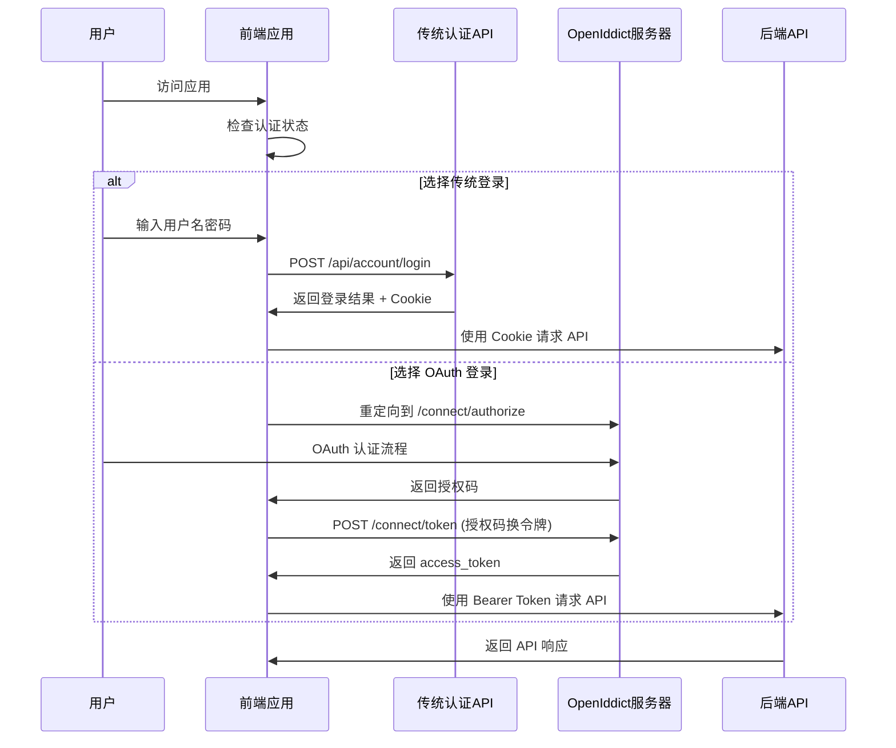

# DFApp 前后端分离迁移实施计划

## [概述 Overview]
将 `src\DFApp.Web\VueApp` 和 `src\DFApp.Web\Pages` 的所有页面迁移到 DFApp.Vue 项目，实现前后端完全分离的架构。

### 项目背景
- **现状**：基于 ABP Framework 的 Razor Pages 应用 + 嵌入式 Vue 组件
- **目标**：完全独立的 Vue 3 单页应用 + RESTful API 后端
- **技术栈**：DFApp.Vue (pure-admin-thin) + ABP OpenIddict 认证

### 核心收益
- ✅ 提升用户体验和页面加载性能
- ✅ 改善代码维护性和开发效率
- ✅ 实现真正的前后端分离架构
- ✅ 支持独立部署和横向扩展
- ✅ 为未来功能扩展提供更好的技术基础

## [Types]
基于 `simplified-swagger.json` 实际 API 规范定义的类型系统。

### 通用 API 类型
```typescript
// ABP 标准分页参数
interface PagedRequestDto {
  skipCount?: number;
  maxResultCount?: number;
  sorting?: string;
}

// ABP 标准分页响应
interface PagedResultDto<T> {
  items: T[];
  totalCount: number;
}

// ABP 应用配置响应
interface ApplicationConfigurationDto {
  localization: Record<string, any>;
  auth: Record<string, any>;
  setting: Record<string, any>;
  currentUser: Record<string, any>;
  features: Record<string, any>;
  globalFeatures: Record<string, any>;
  multiTenancy: Record<string, any>;
  currentTenant: Record<string, any>;
  timing: Record<string, any>;
  clock: Record<string, any>;
  objectExtensions: Record<string, any>;
}
```

### 认证相关类型
```typescript
// 登录请求 (基于 /api/account/login)
interface LoginRequestDto {
  userNameOrEmailAddress: string;
  password: string;
  rememberMe?: boolean;
}

// 登录响应
interface LoginResultDto {
  result: number;
  description: string;
}

// 注册请求 (基于 /api/account/register)
interface RegisterRequestDto {
  userName: string;
  emailAddress: string;
  password: string;
  appName: string;
}

// 传统认证配置
interface AuthConfig {
  // 传统认证
  loginEndpoint: string;
  registerEndpoint: string;
}
```

### Aria2 模块类型
```typescript
// Aria2 状态响应 (基于实际 Schema)
interface TellStatusResultDto {
  id: number;
  gid: string;
  status: string;
  totalLength: string;
  completedLength: string;
  uploadLength: string;
  downloadSpeed: string;
  uploadSpeed: string;
  errorCode: string;
  errorMessage: string;
  files: Array<{
    path: string;
    length: string;
    completedLength: string;
  }>;
}

// 添加下载请求
interface AddDownloadRequestDto {
  urls: string[];
  savePath?: string;
}

// 添加下载响应
interface AddDownloadResponseDto {
  id: string;
}

// 外部链接响应
interface ExternalLinkResponseDto {
  link: string;
}
```

### 记账模块类型
```typescript
// 记账分类 DTO
interface BookkeepingCategoryDto {
  id: number;
  category: string;
}

interface CreateUpdateBookkeepingCategoryDto {
  category: string;
}

// 记账支出 DTO
interface BookkeepingExpenditureDto {
  id: number;
  expenditureDate: string; // ISO 8601 格式
  expenditure: number; // double 类型
  remark: string;
  isBelongToSelf: boolean;
  category: BookkeepingCategoryDto;
  categoryId: number;
}

interface CreateUpdateBookkeepingExpenditureDto {
  expenditureDate: string;
  expenditure: number;
  remark?: string;
  isBelongToSelf: boolean;
  categoryId: number;
}

// 支出查询参数
interface GetExpendituresRequestDto extends PagedRequestDto {
  filter?: string;
  categoryId?: number;
  isBelongToSelf?: boolean;
}

// 图表数据类型 (基于实际 Schema)
interface ChartJSDto {
  labels: string[];
  datasets: Array<{
    label: string;
    data: number[];
  }>;
  total: number;
  compareTotal: number;
  differenceTotal: number;
}

// 图表查询参数
interface ChartDataRequestDto {
  start?: string; // ISO 8601 日期时间
  end?: string;
  compareType?: CompareType; // 枚举: 0,1,2,3
  numberType?: NumberType; // 枚举: 0,1
}

// 月度支出 DTO
interface MonthlyExpenditureDto {
  labels: string[];
  totalData: number[];
  selfData: number[];
  nonSelfData: number[];
  totalAverage: number;
  selfAverage: number;
  nonSelfAverage: number;
}

// 枚举类型
enum CompareType {
  None = 0,
  PreviousPeriod = 1,
  SamePeriodLastYear = 2,
  Custom = 3
}

enum NumberType {
  Amount = 0,
  Count = 1
}
```

### 配置管理类型
```typescript
interface ConfigurationInfoDto {
  id: number;
  moduleName: string;
  configurationName: string;
  configurationValue: string;
  remark: string;
}

interface CreateUpdateConfigurationInfoDto {
  moduleName: string;
  configurationName: string;
  configurationValue: string;
  remark?: string;
}
```

### 动态IP类型
```typescript
interface DynamicIPDto {
  id: string; // UUID 格式
  ip: string;
  port: string;
}

interface CreateUpdateDynamicIPDto {
  ip: string;
  port: string;
}
```

### 文件上传类型
```typescript
interface FileUploadInfoDto {
  id: number;
  fileName: string;
  path: string;
  sha1: string;
  fileSize: number;
}

interface CreateUpdateFileUploadInfoDto {
  fileName: string;
  path: string;
  sha1: string;
  fileSize: number;
}

interface CustomFileTypeDto {
  configurationName: string;
  configurationValue: string;
}
```

### 彩票模块类型
```typescript
// 基础彩票 DTO
interface LotteryDto {
  id: number;
  indexNo: number;
  number: string;
  colorType: string;
  lotteryType: string;
  groupId: number;
}

interface CreateUpdateLotteryDto {
  indexNo: number;
  number: string;
  colorType: string;
  lotteryType: string;
  groupId: number;
}

// 彩票组 DTO
interface LotteryGroupDto {
  id: number;
  indexNo: number;
  lotteryType: string;
  groupId: number;
  redNumbers: string;
  blueNumber: string;
}

// 彩票结果 DTO
interface LotteryResultDto {
  id: number;
  name: string;
  code: string;
  detailsLink: string;
  videoLink: string;
  date: string;
  week: string;
  red: string;
  blue: string;
  blue2: string;
  sales: string;
  poolMoney: string;
  content: string;
  addMoney: string;
  addMoney2: string;
  msg: string;
  z2Add: string;
  m2Add: string;
  prizegrades: Array<{
    type: number;
    typeNum: string;
    typeMoney: string;
  }>;
}

interface CreateUpdateLotteryResultDto {
  name: string;
  code: string;
  detailsLink?: string;
  videoLink?: string;
  date: string;
  week: string;
  red: string;
  blue: string;
  blue2?: string;
  sales?: string;
  poolMoney?: string;
  content?: string;
  addMoney?: string;
  addMoney2?: string;
  msg?: string;
  z2Add?: string;
  m2Add?: string;
  prizegrades?: Array<{
    type: number;
    typeNum: string;
    typeMoney: string;
  }>;
}

// 彩票组合 DTO
interface LotteryCombinationDto {
  // 根据实际需求定义
  [key: string]: any;
}

// 彩票常量 DTO
interface ConstsDto {
  // 根据实际需求定义
  [key: string]: any;
}

// 彩票模拟相关类型
interface GenerateRandomNumbersDto {
  // SSQ 和 KL8 通用接口
  [key: string]: any;
}

interface LotterySimulationDto {
  // SSQ 和 KL8 通用响应
  [key: string]: any;
}

interface StatisticsDto {
  // 统计数据响应
  [key: string]: any;
}

// 中奖统计查询参数
interface StatisticsWinRequestDto extends PagedRequestDto {
  purchasedPeriod?: number;
  winningPeriod?: number;
  lotteryType?: string;
}

interface StatisticsWinItemDto {
  // 中奖统计项
  [key: string]: any;
}
```

### Telegram 模块类型
```typescript
// TG 登录状态响应
interface TGLoginStatusDto {
  status: string;
}

// TG 配置响应
interface TGConfigDto {
  config: string;
}

// TG 聊天响应 (403 Forbidden)
interface TGChatsDto {
  // 需要权限访问
  [key: string]: any;
}
```

### 日志模块类型
```typescript
interface LogEntryDto {
  message: string;
  timestamp: string; // ISO 8601 格式
}

interface GetLogsRequestDto {
  // 根据实际需求定义查询参数
  level?: string;
  startTime?: string;
  endTime?: string;
  keyword?: string;
}
```

## [Files]
详细说明需要创建、修改和删除的文件。

### 新建文件

#### API 服务层
- `DFApp.Vue/src/api/base.ts` - API 基础服务类
- `DFApp.Vue/src/api/lottery.ts` - 彩票模块 API
- `DFApp.Vue/src/api/bookkeeping.ts` - 记账模块 API
- `DFApp.Vue/src/api/configuration.ts` - 配置模块 API
- `DFApp.Vue/src/api/aria2.ts` - Aria2 下载管理 API
- `DFApp.Vue/src/api/fileUpload.ts` - 文件上传下载 API
- `DFApp.Vue/src/api/dynamicIp.ts` - 动态IP API
- `DFApp.Vue/src/api/logViewer.ts` - 日志查看 API
- `DFApp.Vue/src/api/telegram.ts` - Telegram 模块 API

#### 业务页面组件
- `DFApp.Vue/src/views/dashboard/index.vue` - 仪表板首页
- `DFApp.Vue/src/views/aria2/index.vue` - Aria2 管理页面
- `DFApp.Vue/src/views/bookkeeping/` - 记账模块目录
  - `expenditure/index.vue` - 支出管理
  - `expenditure/analysis.vue` - 支出分析 (迁移现有 VueApp 组件)
  - `expenditure/chart.vue` - 支出图表
  - `category/index.vue` - 分类管理
- `DFApp.Vue/src/views/configuration/index.vue` - 配置管理
- `DFApp.Vue/src/views/dynamicIp/index.vue` - 动态IP管理
- `DFApp.Vue/src/views/fileUpload/index.vue` - 文件上传管理
- `DFApp.Vue/src/views/logViewer/index.vue` - 日志查看器
- `DFApp.Vue/src/views/lottery/` - 彩票模块目录
  - `index.vue` - 彩票数据管理
  - `statistics/index.vue` - 统计分析
  - `simulation/ssq/index.vue` - 双色球模拟
  - `simulation/kl8/index.vue` - 快乐8模拟
- `DFApp.Vue/src/views/telegram/` - Telegram 模块目录
  - `login/index.vue` - TG 登录 (迁移现有 VueApp 组件)
  - `media/index.vue` - 媒体管理
  - `media/chart.vue` - 媒体图表 (迁移现有 VueApp 组件)
  - `media/externalLink.vue` - 外部链接管理 (迁移现有 VueApp 组件)

#### 类型定义
- `DFApp.Vue/src/types/api.ts` - API 响应类型
- `DFApp.Vue/src/types/business.ts` - 业务实体类型
- `DFApp.Vue/src/types/auth.ts` - 认证相关类型

#### 路由模块
- `DFApp.Vue/src/router/modules/bookkeeping.ts` - 记账模块路由
- `DFApp.Vue/src/router/modules/lottery.ts` - 彩票模块路由
- `DFApp.Vue/src/router/modules/telegram.ts` - Telegram 模块路由
- `DFApp.Vue/src/router/modules/system.ts` - 系统管理路由
- `DFApp.Vue/src/router/modules/tools.ts` - 工具模块路由

### 迁移文件映射

#### VueApp 组件迁移
| 源文件 | 目标文件 | 迁移方式 |
|--------|----------|----------|
| `VueApp/src/Expenditure/Analysis/App.vue` | `views/bookkeeping/expenditure/analysis.vue` | 重构为 Composition API + API 调用 |
| `VueApp/src/FileUpDownload/Upload/App.vue` | `views/fileUpload/upload.vue` | 重构 + HTTP API |
| `VueApp/src/LogSink/QueueSink/App.vue` | `views/logViewer/queue.vue` | 重构 + SignalR 集成 |
| `VueApp/src/Media/Chart/App.vue` | `views/telegram/media/chart.vue` | 重构 + API 调用 |
| `VueApp/src/Media/ExternalLink/App.vue` | `views/telegram/media/externalLink.vue` | 重构 + API 调用 |
| `VueApp/src/TG/Login/App.vue` | `views/telegram/login/index.vue` | 重构 + API 调用 |

#### Razor Pages 转换
| 源页面 | 目标组件 | 转换要点 |
|--------|----------|----------|
| `Pages/Index.cshtml` | `views/dashboard/index.vue` | 移除服务器端渲染，改为客户端数据获取 |
| `Pages/Aria2/Index.cshtml` | `views/aria2/index.vue` | 表格操作改为 API 调用 |
| `Pages/Bookkeeping/Expenditure/Index.cshtml` | `views/bookkeeping/expenditure/index.vue` | CRUD 操作改为 RESTful API |
| `Pages/Configuration/Index.cshtml` | `views/configuration/index.vue` | 配置管理改为 API 调用 |
| `Pages/Lottery/Index.cshtml` | `views/lottery/index.vue` | 数据操作改为 API 调用 |

### 修改文件
- ✅ `DFApp.Vue/package.json` - 添加新依赖包
- ✅ `DFApp.Vue/.env.development` - 更新环境变量
- ✅ `DFApp.Vue/vite.config.ts` - 配置 API 代理
- `DFApp.Vue/src/router/index.ts` - 集成认证路由守卫
- `DFApp.Vue/src/store/index.ts` - 添加业务模块状态
- `DFApp.Vue/src/utils/http/index.ts` - 集成 OpenIddict 令牌管理

### 删除文件（迁移完成后）
- `src/DFApp.Web/VueApp/` - 整个目录及其子目录
- `src/DFApp.Web/Pages/` - 除认证和错误页面外的所有页面
- `src/DFApp.Web/package.json` - 清理 Vue 相关依赖
- `src/DFApp.Web/yarn.lock` - 移除前端依赖锁定文件

## [Functions]
详细说明需要创建和修改的函数。

### 新建函数

#### OpenIddict 认证函数 (`DFApp.Vue/src/utils/oidc.ts`)
```typescript
// 初始化认证管理器
function initAuthManager(): UserManager

// 启动认证流程
async function startAuthentication(): Promise<void>

// 处理认证回调
async function handleAuthCallback(): Promise<User | null>

// 获取当前用户信息
async function getCurrentUser(): Promise<User | null>

// 静默刷新令牌
async function silentRenew(): Promise<User | null>

// 登出
async function logout(): Promise<void>

// 检查认证状态
function isAuthenticated(): boolean
```

#### API 基础服务函数 (`DFApp.Vue/src/api/base.ts`)
```typescript
// API 基础服务类
class ApiService {
  protected baseURL: string;
  protected http: AxiosInstance;
  
  constructor(baseURL: string);
  
  // 通用请求方法
  protected async request<T>(config: AxiosRequestConfig): Promise<T>;
  protected async get<T>(url: string, params?: any): Promise<T>;
  protected async post<T>(url: string, data?: any): Promise<T>;
  protected async put<T>(url: string, data?: any): Promise<T>;
  protected async delete<T>(url: string): Promise<T>;
}
```

#### 基于实际 API 端点的业务模块函数

```typescript
// ABP 应用配置 API (DFApp.Vue/src/api/abp.ts)
class AbpApi extends ApiService {
  // GET /api/abp/application-configuration
  async getApplicationConfiguration(): Promise<ApplicationConfigurationDto> {
    return this.get('/api/abp/application-configuration');
  }
}

// 认证 API (DFApp.Vue/src/api/auth.ts) - 混合认证支持
class AuthApi extends ApiService {
  // POST /api/account/login - 传统登录
  async login(request: LoginRequestDto): Promise<LoginResultDto> {
    return this.post('/api/account/login', request);
  }

  // POST /api/account/register - 用户注册
  async register(request: RegisterRequestDto): Promise<void> {
    return this.post('/api/account/register', request);
  }

  // OpenIddict 相关方法
  async getOidcConfig(): Promise<AuthConfig> {
    // 返回客户端配置
  }

  async handleOidcCallback(): Promise<void> {
    // 处理 OAuth 回调
  }
}

// Aria2 管理 API (DFApp.Vue/src/api/aria2.ts)
class Aria2Api extends ApiService {
  // GET /api/app/aria2 - 获取下载状态
  async getAria2Status(params?: PagedRequestDto & { filter?: string }): Promise<PagedResultDto<TellStatusResultDto>> {
    return this.get('/api/app/aria2', params);
  }

  // POST /api/app/aria2 - 添加下载
  async addDownload(request: AddDownloadRequestDto): Promise<AddDownloadResponseDto> {
    return this.post('/api/app/aria2', request);
  }

  // GET /api/app/aria2/{id}/external-link - 获取外部链接
  async getExternalLink(id: number): Promise<ExternalLinkResponseDto> {
    return this.get(`/api/app/aria2/${id}/external-link`);
  }
}

// 记账分类 API (DFApp.Vue/src/api/bookkeeping.ts)
class BookkeepingCategoryApi extends ApiService {
  // GET /api/app/bookkeeping-category
  async getCategories(params?: PagedRequestDto): Promise<PagedResultDto<BookkeepingCategoryDto>> {
    return this.get('/api/app/bookkeeping-category', params);
  }

  // POST /api/app/bookkeeping-category
  async createCategory(request: CreateUpdateBookkeepingCategoryDto): Promise<BookkeepingCategoryDto> {
    return this.post('/api/app/bookkeeping-category', request);
  }

  // PUT /api/app/bookkeeping-category/{id}
  async updateCategory(id: number, request: CreateUpdateBookkeepingCategoryDto): Promise<BookkeepingCategoryDto> {
    return this.put(`/api/app/bookkeeping-category/${id}`, request);
  }

  // DELETE /api/app/bookkeeping-category/{id}
  async deleteCategory(id: number): Promise<void> {
    return this.delete(`/api/app/bookkeeping-category/${id}`);
  }
}

// 记账支出 API (DFApp.Vue/src/api/bookkeeping.ts)
class BookkeepingExpenditureApi extends ApiService {
  // GET /api/app/bookkeeping-expenditure
  async getExpenditures(params?: GetExpendituresRequestDto): Promise<PagedResultDto<BookkeepingExpenditureDto>> {
    return this.get('/api/app/bookkeeping-expenditure', params);
  }

  // POST /api/app/bookkeeping-expenditure
  async createExpenditure(request: CreateUpdateBookkeepingExpenditureDto): Promise<BookkeepingExpenditureDto> {
    return this.post('/api/app/bookkeeping-expenditure', request);
  }

  // PUT /api/app/bookkeeping-expenditure/{id}
  async updateExpenditure(id: number, request: CreateUpdateBookkeepingExpenditureDto): Promise<BookkeepingExpenditureDto> {
    return this.put(`/api/app/bookkeeping-expenditure/${id}`, request);
  }

  // DELETE /api/app/bookkeeping-expenditure/{id}
  async deleteExpenditure(id: number): Promise<void> {
    return this.delete(`/api/app/bookkeeping-expenditure/${id}`);
  }

  // GET /api/app/bookkeeping-expenditure/chart - 图表数据
  async getChartData(params?: ChartDataRequestDto): Promise<ChartJSDto> {
    return this.get('/api/app/bookkeeping-expenditure/chart', params);
  }

  // GET /api/app/bookkeeping-expenditure/monthly-expenditure - 月度支出
  async getMonthlyExpenditure(year?: number): Promise<MonthlyExpenditureDto> {
    return this.get('/api/app/bookkeeping-expenditure/monthly-expenditure', { year });
  }
}

// 配置管理 API (DFApp.Vue/src/api/configuration.ts)
class ConfigurationApi extends ApiService {
  // GET /api/app/configuration-info
  async getConfigurations(params?: PagedRequestDto): Promise<PagedResultDto<ConfigurationInfoDto>> {
    return this.get('/api/app/configuration-info', params);
  }

  // POST /api/app/configuration-info
  async createConfiguration(request: CreateUpdateConfigurationInfoDto): Promise<ConfigurationInfoDto> {
    return this.post('/api/app/configuration-info', request);
  }

  // PUT /api/app/configuration-info/{id}
  async updateConfiguration(id: number, request: CreateUpdateConfigurationInfoDto): Promise<ConfigurationInfoDto> {
    return this.put(`/api/app/configuration-info/${id}`, request);
  }

  // DELETE /api/app/configuration-info/{id}
  async deleteConfiguration(id: number): Promise<void> {
    return this.delete(`/api/app/configuration-info/${id}`);
  }
}

// 动态IP API (DFApp.Vue/src/api/dynamicIp.ts)
class DynamicIpApi extends ApiService {
  // GET /api/app/dynamic-ip
  async getDynamicIPs(params?: PagedRequestDto): Promise<PagedResultDto<DynamicIPDto>> {
    return this.get('/api/app/dynamic-ip', params);
  }

  // POST /api/app/dynamic-ip
  async createDynamicIP(request: CreateUpdateDynamicIPDto): Promise<DynamicIPDto> {
    return this.post('/api/app/dynamic-ip', request);
  }

  // PUT /api/app/dynamic-ip/{id}
  async updateDynamicIP(id: string, request: CreateUpdateDynamicIPDto): Promise<DynamicIPDto> {
    return this.put(`/api/app/dynamic-ip/${id}`, request);
  }

  // DELETE /api/app/dynamic-ip/{id}
  async deleteDynamicIP(id: string): Promise<void> {
    return this.delete(`/api/app/dynamic-ip/${id}`);
  }
}

// 文件上传 API (DFApp.Vue/src/api/fileUpload.ts)
class FileUploadApi extends ApiService {
  // GET /api/app/file-upload-info
  async getFileUploadInfos(params?: PagedRequestDto): Promise<PagedResultDto<FileUploadInfoDto>> {
    return this.get('/api/app/file-upload-info', params);
  }

  // POST /api/app/file-upload-info
  async createFileUploadInfo(request: CreateUpdateFileUploadInfoDto): Promise<FileUploadInfoDto> {
    return this.post('/api/app/file-upload-info', request);
  }

  // PUT /api/app/file-upload-info/{id}
  async updateFileUploadInfo(id: number, request: CreateUpdateFileUploadInfoDto): Promise<FileUploadInfoDto> {
    return this.put(`/api/app/file-upload-info/${id}`, request);
  }

  // DELETE /api/app/file-upload-info/{id}
  async deleteFileUploadInfo(id: number): Promise<void> {
    return this.delete(`/api/app/file-upload-info/${id}`);
  }

  // GET /api/app/file-upload-info/configuration-value
  async getCustomFileTypeConfig(configurationName?: string): Promise<CustomFileTypeDto> {
    return this.get('/api/app/file-upload-info/configuration-value', { configurationName });
  }

  // 文件上传辅助方法
  async uploadFile(file: File, onProgress?: (progress: number) => void): Promise<FileUploadInfoDto> {
    // 实现文件上传逻辑
    const formData = new FormData();
    formData.append('file', file);
    
    // 使用 axios 上传并监听进度
    return this.post('/api/app/file-upload', formData, {
      headers: { 'Content-Type': 'multipart/form-data' },
      onUploadProgress: (progressEvent) => {
        if (onProgress && progressEvent.total) {
          const progress = Math.round((progressEvent.loaded * 100) / progressEvent.total);
          onProgress(progress);
        }
      }
    });
  }
}

// 彩票基础 API (DFApp.Vue/src/api/lottery.ts)
class LotteryApi extends ApiService {
  // GET /api/app/lottery
  async getLotteries(params?: PagedRequestDto): Promise<PagedResultDto<LotteryDto>> {
    return this.get('/api/app/lottery', params);
  }

  // POST /api/app/lottery
  async createLottery(request: CreateUpdateLotteryDto): Promise<LotteryDto> {
    return this.post('/api/app/lottery', request);
  }

  // PUT /api/app/lottery/{id}
  async updateLottery(id: number, request: CreateUpdateLotteryDto): Promise<LotteryDto> {
    return this.put(`/api/app/lottery/${id}`, request);
  }

  // DELETE /api/app/lottery/{id}
  async deleteLottery(id: number): Promise<void> {
    return this.delete(`/api/app/lottery/${id}`);
  }

  // GET /api/app/lottery-grouped
  async getLotteryGroups(params?: PagedRequestDto): Promise<PagedResultDto<LotteryGroupDto>> {
    return this.get('/api/app/lottery-grouped', params);
  }

  // POST /api/app/lottery-grouped
  async createLotteryGroup(request: CreateUpdateLotteryDto): Promise<LotteryGroupDto> {
    return this.post('/api/app/lottery-grouped', request);
  }

  // GET /api/app/lottery/consts
  async getLotteryConsts(): Promise<ConstsDto> {
    return this.get('/api/app/lottery/consts');
  }
}

// 彩票结果 API (DFApp.Vue/src/api/lottery.ts)
class LotteryResultApi extends ApiService {
  // GET /api/app/lottery-result
  async getLotteryResults(params?: PagedRequestDto): Promise<PagedResultDto<LotteryResultDto>> {
    return this.get('/api/app/lottery-result', params);
  }

  // POST /api/app/lottery-result
  async createLotteryResult(request: CreateUpdateLotteryResultDto): Promise<LotteryResultDto> {
    return this.post('/api/app/lottery-result', request);
  }

  // PUT /api/app/lottery-result/{id}
  async updateLotteryResult(id: number, request: CreateUpdateLotteryResultDto): Promise<LotteryResultDto> {
    return this.put(`/api/app/lottery-result/${id}`, request);
  }

  // DELETE /api/app/lottery-result/{id}
  async deleteLotteryResult(id: number): Promise<void> {
    return this.delete(`/api/app/lottery-result/${id}`);
  }
}

// 彩票模拟 API (DFApp.Vue/src/api/lottery.ts)
class LotterySimulationApi extends ApiService {
  // POST /api/app/lottery/simulation/kl8
  async generateKL8Simulation(request: GenerateRandomNumbersDto): Promise<LotterySimulationDto> {
    return this.post('/api/app/lottery/simulation/kl8', request);
  }

  // GET /api/app/lottery/simulation/kl8/statistics
  async getKL8Statistics(termNumber?: number): Promise<StatisticsDto> {
    return this.get('/api/app/lottery/simulation/kl8/statistics', { termNumber });
  }

  // POST /api/app/lottery/simulation/ssq
  async generateSSQSimulation(request: GenerateRandomNumbersDto): Promise<LotterySimulationDto> {
    return this.post('/api/app/lottery/simulation/ssq', request);
  }

  // GET /api/app/lottery/simulation/ssq/statistics
  async getSSQStatistics(termNumber?: number): Promise<StatisticsDto> {
    return this.get('/api/app/lottery/simulation/ssq/statistics', { termNumber });
  }
}

// 彩票统计 API (DFApp.Vue/src/api/lottery.ts)
class LotteryStatisticsApi extends ApiService {
  // GET /api/app/lottery/statistics-win
  async getWinStatistics(params?: StatisticsWinRequestDto): Promise<PagedResultDto<StatisticsWinItemDto>> {
    return this.get('/api/app/lottery/statistics-win', params);
  }
}

// 彩票组合 API (DFApp.Vue/src/api/lottery.ts)
class LotteryCombinationApi extends ApiService {
  // POST /api/app/lottery-combination
  async generateCombination(request: LotteryCombinationDto): Promise<LotteryCombinationDto> {
    return this.post('/api/app/lottery-combination', request);
  }
}

// Telegram API (DFApp.Vue/src/api/telegram.ts)
class TelegramApi extends ApiService {
  // POST /api/app/tg-login/status
  async getTGLoginStatus(): Promise<TGLoginStatusDto> {
    return this.post('/api/app/tg-login/status');
  }

  // POST /api/app/tg-login/config
  async getTGLoginConfig(value?: string): Promise<TGConfigDto> {
    return this.post('/api/app/tg-login/config', null, { params: { value } });
  }

  // POST /api/app/tg-login/chats (需要权限)
  async getTGChats(): Promise<TGChatsDto> {
    return this.post('/api/app/tg-login/chats');
  }
}

// 日志查看 API (DFApp.Vue/src/api/logViewer.ts)
class LogViewerApi extends ApiService {
  // GET /api/log-sink/queuesink/logs
  async getLogs(): Promise<LogEntryDto[]> {
    return this.get('/api/log-sink/queuesink/logs');
  }

  // SignalR 连接管理
  async connectLogHub(): Promise<HubConnection> {
    const connection = new HubConnectionBuilder()
      .withUrl('/logHub')
      .build();
    
    await connection.start();
    return connection;
  }

  async subscribeToLogs(callback: (log: LogEntryDto) => void): Promise<void> {
    const connection = await this.connectLogHub();
    connection.on('NewLog', callback);
  }
}
```

### 修改函数

#### 路由守卫函数 (`DFApp.Vue/src/router/index.ts`)
```typescript
// 修改现有的路由守卫，添加权限检查
router.beforeEach(async (to, from, next) => {
  // 添加认证检查
  // 添加权限验证
  // 处理令牌刷新
})
```

#### 状态管理函数 (`DFApp.Vue/src/store/modules/auth.ts`)
```typescript
// 登录 action
async function login(credentials: LoginRequest): Promise<void>

// 登出 action
async function logout(): Promise<void>

// 获取用户信息 action
async function getUserInfo(): Promise<void>
```

## [Classes]
详细说明需要创建和修改的类。

### 新建类

#### HTTP 客户端类 (`DFApp.Vue/src/utils/http.ts`)
```typescript
class HttpClient {
  private instance: AxiosInstance;
  
  constructor(baseURL: string) {
    // 初始化 axios 实例
    // 设置请求拦截器
    // 设置响应拦截器
  }
  
  async request<T>(config: AxiosRequestConfig): Promise<ApiResponse<T>>
  async get<T>(url: string, params?: any): Promise<ApiResponse<T>>
  async post<T>(url: string, data?: any): Promise<ApiResponse<T>>
  async put<T>(url: string, data?: any): Promise<ApiResponse<T>>
  async delete<T>(url: string): Promise<ApiResponse<T>>
}
```

#### 认证管理类 (`DFApp.Vue/src/utils/auth.ts`)
```typescript
class AuthManager {
  private tokenKey: string = 'access_token';
  private refreshTokenKey: string = 'refresh_token';
  
  getToken(): string | null
  setToken(token: string): void
  clearToken(): void
  isAuthenticated(): boolean
  async refreshToken(): Promise<boolean>
}
```

#### API 服务基类 (`DFApp.Vue/src/api/base.ts`)
```typescript
abstract class BaseApiService {
  protected http: HttpClient;
  protected baseUrl: string;
  
  constructor(baseUrl: string) {
    this.baseUrl = baseUrl;
    this.http = new HttpClient(baseUrl);
  }
  
  protected buildUrl(endpoint: string): string
}
```

### 修改类

#### 现有组件类重构
将现有的 VueApp 组件从 Options API 重构为 Composition API：
```typescript
// 示例：支出分析组件
export default defineComponent({
  name: 'ExpenditureAnalysis',
  setup() {
    // 使用 Composition API 重构
    // 添加响应式数据
    // 添加计算属性
    // 添加方法
    // 添加生命周期钩子
  }
})
```

## [混合认证集成方案]
基于实际 API 分析，设计支持传统登录和 OpenIddict 的混合认证方案。

### 🔍 认证策略分析
根据 `simplified-swagger.json` 发现：
- **传统认证端点**：`/api/account/login` 和 `/api/account/register`
- **OpenIddict 端点**：`/connect/*` 系列（OAuth 2.0 标准端点）
- **应用配置端点**：`/api/abp/application-configuration`（包含认证配置）

### 混合认证流程设计


### 认证配置架构
```typescript
// DFApp.Vue/src/config/auth.ts - 混合认证配置
export interface AuthConfig {
  // 认证模式
  mode: 'traditional' | 'oauth' | 'hybrid';
  
  // 传统认证配置
  traditional: {
    loginEndpoint: string;
    registerEndpoint: string;
    logoutEndpoint: string;
    cookieName: string;
  };
  
  // OpenIddict OAuth 配置
  oauth: {
    authority: string;
    clientId: string;
    redirectUri: string;
    postLogoutRedirectUri: string;
    responseType: string;
    scope: string;
    automaticSilentRenew: boolean;
    silentRedirectUri: string;
    usePkce: boolean;
  };
  
  // ABP 应用配置
  abp: {
    applicationConfigurationEndpoint: string;
  };
}

export const authConfig: AuthConfig = {
  mode: 'hybrid', // 支持两种认证方式
  
  traditional: {
    loginEndpoint: '/api/account/login',
    registerEndpoint: '/api/account/register',
    logoutEndpoint: '/api/account/logout',
    cookieName: 'XSRF-TOKEN'
  },
  
  oauth: {
    authority: 'https://localhost:44369',
    clientId: 'DFApp_Web',
    redirectUri: `${window.location.origin}/auth/callback`,
    postLogoutRedirectUri: `${window.location.origin}/`,
    responseType: 'code',
    scope: 'openid profile email roles permissions DFApp offline_access',
    automaticSilentRenew: true,
    silentRedirectUri: `${window.location.origin}/auth/silent-callback`,
    usePkce: true
  },
  
  abp: {
    applicationConfigurationEndpoint: '/api/abp/application-configuration'
  }
};
```

### 混合认证服务类
```typescript
// DFApp.Vue/src/utils/auth.ts - 混合认证服务
import { UserManager, User } from 'oidc-client-ts';
import { authConfig } from '@/config/auth';
import { AuthApi } from '@/api/auth';
import { AbpApi } from '@/api/abp';

export enum AuthMode {
  Traditional = 'traditional',
  OAuth = 'oauth'
}

export interface AuthState {
  isAuthenticated: boolean;
  mode: AuthMode | null;
  user: any;
  token: string | null;
}

export class HybridAuthService {
  private userManager: UserManager;
  private authApi: AuthApi;
  private abpApi: AbpApi;
  private currentMode: AuthMode | null = null;

  constructor() {
    this.userManager = new UserManager({
      authority: authConfig.oauth.authority,
      client_id: authConfig.oauth.clientId,
      redirect_uri: authConfig.oauth.redirectUri,
      post_logout_redirect_uri: authConfig.oauth.postLogoutRedirectUri,
      response_type: authConfig.oauth.responseType,
      scope: authConfig.oauth.scope,
      automaticSilentRenew: authConfig.oauth.automaticSilentRenew,
      silent_redirect_uri: authConfig.oauth.silentRedirectUri,
      userStore: new WebStorageStateStore({ store: window.localStorage })
    });

    this.authApi = new AuthApi();
    this.abpApi = new AbpApi();
  }

  // 获取 ABP 应用配置
  async getApplicationConfiguration(): Promise<ApplicationConfigurationDto> {
    return await this.abpApi.getApplicationConfiguration();
  }

  // 传统登录
  async loginTraditional(credentials: LoginRequestDto): Promise<LoginResultDto> {
    try {
      const result = await this.authApi.login(credentials);
      if (result.result === 1) { // 假设 1 表示成功
        this.currentMode = AuthMode.Traditional;
        // 传统登录通常使用 Cookie，无需手动管理 token
      }
      return result;
    } catch (error) {
      throw new Error(`传统登录失败: ${error.message}`);
    }
  }

  // OAuth 登录
  async loginOAuth(): Promise<void> {
    try {
      await this.userManager.signinRedirect();
      this.currentMode = AuthMode.OAuth;
    } catch (error) {
      throw new Error(`OAuth 登录失败: ${error.message}`);
    }
  }

  // 处理 OAuth 回调
  async handleOAuthCallback(): Promise<User | null> {
    try {
      const user = await this.userManager.signinRedirectCallback();
      if (user) {
        this.currentMode = AuthMode.OAuth;
      }
      return user;
    } catch (error) {
      throw new Error(`OAuth 回调处理失败: ${error.message}`);
    }
  }

  // 获取当前用户（OAuth）
  async getCurrentOAuthUser(): Promise<User | null> {
    try {
      return await this.userManager.getUser();
    } catch (error) {
      console.error('获取 OAuth 用户失败:', error);
      return null;
    }
  }

  // 静默刷新 OAuth 令牌
  async renewOAuthToken(): Promise<User | null> {
    try {
      return await this.userManager.signinSilent();
    } catch (error) {
      console.error('OAuth 令牌刷新失败:', error);
      return null;
    }
  }

  // 统一登出
  async logout(): Promise<void> {
    try {
      if (this.currentMode === AuthMode.OAuth) {
        await this.userManager.signoutRedirect();
      } else if (this.currentMode === AuthMode.Traditional) {
        // 传统登出 - 清除 Cookie
        document.cookie = `${authConfig.traditional.cookieName}=; expires=Thu, 01 Jan 1970 00:00:00 UTC; path=/;`;
        // 可以调用后端登出接口
        // await this.authApi.logout();
      }
      this.currentMode = null;
    } catch (error) {
      console.error('登出失败:', error);
      throw error;
    }
  }

  // 检查认证状态
  async isAuthenticated(): Promise<boolean> {
    try {
      // 检查 OAuth 认证
      const oauthUser = await this.getCurrentOAuthUser();
      if (oauthUser && !oauthUser.expired) {
        this.currentMode = AuthMode.OAuth;
        return true;
      }

      // 检查传统认证（通过 Cookie 或调用配置接口）
      try {
        const config = await this.getApplicationConfiguration();
        if (config.currentUser && Object.keys(config.currentUser).length > 0) {
          this.currentMode = AuthMode.Traditional;
          return true;
        }
      } catch (error) {
        // 配置接口调用失败，可能未认证
      }

      return false;
    } catch (error) {
      console.error('认证状态检查失败:', error);
      return false;
    }
  }

  // 获取当前认证模式
  getCurrentMode(): AuthMode | null {
    return this.currentMode;
  }

  // 获取访问令牌（OAuth 模式）
  async getAccessToken(): Promise<string | null> {
    if (this.currentMode === AuthMode.OAuth) {
      const user = await this.getCurrentOAuthUser();
      return user?.access_token || null;
    }
    return null;
  }

  // 用户注册
  async register(request: RegisterRequestDto): Promise<void> {
    return await this.authApi.register(request);
  }
}

// 导出单例实例
export const hybridAuthService = new HybridAuthService();
```

### HTTP 拦截器集成
```typescript
// DFApp.Vue/src/utils/http/interceptors.ts - HTTP 拦截器
import { hybridAuthService, AuthMode } from '@/utils/auth';

// 请求拦截器
export const requestInterceptor = async (config: any) => {
  const mode = hybridAuthService.getCurrentMode();
  
  if (mode === AuthMode.OAuth) {
    // OAuth 模式：添加 Bearer Token
    const token = await hybridAuthService.getAccessToken();
    if (token) {
      config.headers.Authorization = `Bearer ${token}`;
    }
  } else if (mode === AuthMode.Traditional) {
    // 传统模式：确保 Cookie 被发送
    config.withCredentials = true;
    
    // 添加 CSRF Token（如果需要）
    const csrfToken = getCsrfToken();
    if (csrfToken) {
      config.headers['X-CSRF-TOKEN'] = csrfToken;
    }
  }
  
  return config;
};

// 响应拦截器
export const responseInterceptor = {
  success: (response: any) => response,
  
  error: async (error: any) => {
    if (error.response?.status === 401) {
      // 未授权，尝试刷新令牌或重新登录
      const mode = hybridAuthService.getCurrentMode();
      
      if (mode === AuthMode.OAuth) {
        try {
          await hybridAuthService.renewOAuthToken();
          // 重试原请求
          return axios.request(error.config);
        } catch (refreshError) {
          // 刷新失败，跳转到登录页
          await hybridAuthService.logout();
          window.location.href = '/login';
        }
      } else {
        // 传统模式认证失败，跳转到登录页
        await hybridAuthService.logout();
        window.location.href = '/login';
      }
    }
    
    return Promise.reject(error);
  }
};

// 获取 CSRF Token
function getCsrfToken(): string | null {
  const name = 'XSRF-TOKEN';
  const value = `; ${document.cookie}`;
  const parts = value.split(`; ${name}=`);
  if (parts.length === 2) {
    return parts.pop()?.split(';').shift() || null;
  }
  return null;
}
```

### 路由守卫集成
```typescript
// DFApp.Vue/src/router/guards.ts - 路由守卫
import { hybridAuthService } from '@/utils/auth';

export const authGuard = async (to: any, from: any, next: any) => {
  // 检查路由是否需要认证
  if (to.meta?.requiresAuth !== false) {
    const isAuthenticated = await hybridAuthService.isAuthenticated();
    
    if (!isAuthenticated) {
      // 未认证，重定向到登录页
      next({
        path: '/login',
        query: { redirect: to.fullPath }
      });
      return;
    }
  }
  
  next();
};
```

### 登录页面组件
```typescript
// DFApp.Vue/src/views/login/index.vue - 登录页面
<template>
  <div class="login-container">
    <el-card class="login-card">
      <template #header>
        <h2>用户登录</h2>
      </template>
      
      <!-- 登录方式选择 -->
      <el-radio-group v-model="loginMode" class="login-mode-selector">
        <el-radio-button label="traditional">账号密码</el-radio-button>
        <el-radio-button label="oauth">OAuth 登录</el-radio-button>
      </el-radio-group>
      
      <!-- 传统登录表单 -->
      <el-form 
        v-if="loginMode === 'traditional'"
        ref="loginFormRef"
        :model="loginForm"
        :rules="loginRules"
        @submit.prevent="handleTraditionalLogin"
      >
        <el-form-item prop="userNameOrEmailAddress">
          <el-input
            v-model="loginForm.userNameOrEmailAddress"
            placeholder="用户名或邮箱"
            prefix-icon="User"
          />
        </el-form-item>
        
        <el-form-item prop="password">
          <el-input
            v-model="loginForm.password"
            type="password"
            placeholder="密码"
            prefix-icon="Lock"
            show-password
          />
        </el-form-item>
        
        <el-form-item>
          <el-checkbox v-model="loginForm.rememberMe">
            记住我
          </el-checkbox>
        </el-form-item>
        
        <el-form-item>
          <el-button 
            type="primary" 
            :loading="loading"
            @click="handleTraditionalLogin"
            style="width: 100%"
          >
            登录
          </el-button>
        </el-form-item>
      </el-form>
      
      <!-- OAuth 登录 -->
      <div v-else class="oauth-login">
        <el-button 
          type="primary" 
          :loading="loading"
          @click="handleOAuthLogin"
          style="width: 100%"
        >
          使用 OAuth 登录
        </el-button>
      </div>
      
      <!-- 注册链接 -->
      <div class="register-link">
        <router-link to="/register">没有账号？立即注册</router-link>
      </div>
    </el-card>
  </div>
</template>

<script setup lang="ts">
import { ref, reactive } from 'vue';
import { useRouter } from 'vue-router';
import { ElMessage } from 'element-plus';
import { hybridAuthService } from '@/utils/auth';
import type { LoginRequestDto } from '@/types/auth';

const router = useRouter();
const loading = ref(false);
const loginMode = ref<'traditional' | 'oauth'>('traditional');

const loginForm = reactive<LoginRequestDto>({
  userNameOrEmailAddress: '',
  password: '',
  rememberMe: false
});

const loginRules = {
  userNameOrEmailAddress: [
    { required: true, message: '请输入用户名或邮箱', trigger: 'blur' }
  ],
  password: [
    { required: true, message: '请输入密码', trigger: 'blur' }
  ]
};

// 传统登录
const handleTraditionalLogin = async () => {
  loading.value = true;
  try {
    const result = await hybridAuthService.loginTraditional(loginForm);
    if (result.result === 1) {
      ElMessage.success('登录成功');
      router.push('/dashboard');
    } else {
      ElMessage.error(result.description || '登录失败');
    }
  } catch (error) {
    ElMessage.error(error.message || '登录失败');
  } finally {
    loading.value = false;
  }
};

// OAuth 登录
const handleOAuthLogin = async () => {
  loading.value = true;
  try {
    await hybridAuthService.loginOAuth();
    // OAuth 登录会重定向，不需要额外处理
  } catch (error) {
    ElMessage.error(error.message || 'OAuth 登录失败');
    loading.value = false;
  }
};
</script>
```

### 认证回调页面
```typescript
// DFApp.Vue/src/views/auth/callback.vue - OAuth 回调处理
<template>
  <div class="auth-callback">
    <el-loading-directive v-loading="true" text="正在处理登录..." />
  </div>
</template>

<script setup lang="ts">
import { onMounted } from 'vue';
import { useRouter } from 'vue-router';
import { ElMessage } from 'element-plus';
import { hybridAuthService } from '@/utils/auth';

const router = useRouter();

onMounted(async () => {
  try {
    const user = await hybridAuthService.handleOAuthCallback();
    if (user) {
      ElMessage.success('登录成功');
      // 获取重定向地址
      const redirect = new URLSearchParams(window.location.search).get('redirect');
      router.push(redirect || '/dashboard');
    } else {
      throw new Error('登录失败');
    }
  } catch (error) {
    ElMessage.error(error.message || 'OAuth 登录处理失败');
    router.push('/login');
  }
});
</script>
```

## [Dependencies]
基于现有 DFApp.Vue 项目和新需求，更新依赖配置。

### 现有依赖分析
DFApp.Vue 项目已包含的核心依赖：
- ✅ `axios: ^1.11.0` - HTTP 客户端
- ✅ `element-plus: ^2.10.4` - UI 组件库
- ✅ `echarts: ^5.6.0` - 图表库
- ✅ `pinia: ^3.0.3` - 状态管理
- ✅ `vue-router: ^4.5.1` - 路由管理

### 新增依赖包
```json
{
  "dependencies": {
    "oidc-client-ts": "^3.0.1",
    "@microsoft/signalr": "^8.0.0",
    "crypto-js": "^4.2.0",
    "chart.js": "^4.4.0"
  },
  "devDependencies": {
    "@types/crypto-js": "^4.2.0"
  }
}
```

### 依赖说明
- `oidc-client-ts` - OpenID Connect 客户端，集成 ABP OpenIddict 认证
- `@microsoft/signalr` - SignalR 客户端，用于实时日志查看等功能
- `crypto-js` - 加密工具库，用于敏感数据处理
- `chart.js` - 已存在 echarts，保留 chart.js 用于特定图表需求

### 环境配置更新
更新 `.env.development`：
```bash
# 平台本地运行端口号
VITE_PORT = 8848

# 开发环境读取配置文件路径
VITE_PUBLIC_PATH = /

# 开发环境路由历史模式
VITE_ROUTER_HISTORY = "hash"

# 后端 API 基础地址
VITE_API_BASE_URL = "https://localhost:44350"

# OpenIddict 认证服务器地址
VITE_AUTH_AUTHORITY = "https://localhost:44369"

# OAuth 客户端 ID
VITE_OAUTH_CLIENT_ID = "DFApp_Web"
```

更新 `vite.config.ts` 代理配置：
```typescript
export default ({ mode }: ConfigEnv): UserConfigExport => {
  const { VITE_PORT, VITE_API_BASE_URL } = wrapperEnv(loadEnv(mode, root));
  
  return {
    server: {
      port: VITE_PORT,
      proxy: {
        '/api': {
          target: VITE_API_BASE_URL,
          changeOrigin: true,
          secure: false,
          rewrite: (path) => path.replace(/^\/api/, '/api')
        },
        '/connect': {
          target: 'https://localhost:44369',
          changeOrigin: true,
          secure: false
        }
      }
    }
  };
};
```

## [Testing]
详细说明测试策略和测试文件要求。

### 测试文件结构
```
DFApp.Vue/tests/
├── unit/
│   ├── components/
│   ├── utils/
│   └── api/
├── integration/
│   ├── auth/
│   └── api/
└── e2e/
    ├── login.spec.ts
    ├── lottery.spec.ts
    └── bookkeeping.spec.ts
```

### 单元测试
- 为所有 API 服务类编写单元测试
- 为认证工具类编写测试
- 为关键组件编写组件测试

### 集成测试
- 测试认证流程集成
- 测试 API 调用集成
- 测试路由权限集成

### E2E 测试
- 用户登录流程测试
- 主要功能模块的端到端测试
- 权限控制测试

### 测试配置
更新测试配置文件，添加必要的测试工具和模拟数据。

## [Implementation Order]
基于现有项目分析，制定详细的分阶段实施策略。

### 📋 总体时间规划：8-10周
- **第一阶段**：基础设施搭建（2周）
- **第二阶段**：认证与API层（2-3周）
- **第三阶段**：组件迁移（3-4周）
- **第四阶段**：集成测试与优化（1周）
- **第五阶段**：部署上线（1周）


### 🔌 第二阶段：认证与API层（第3-5周）

#### 2.1 API 服务层架构
- [ ] **API 基础类**
  - 创建 `DFApp.Vue/src/api/base.ts` 基础服务类
  - 实现通用的 CRUD 操作方法
  - 添加统一的错误处理和响应格式化

- [ ] **业务模块 API**
  - `DFApp.Vue/src/api/bookkeeping.ts` - 记账模块 API
  - `DFApp.Vue/src/api/lottery.ts` - 彩票模块 API
  - `DFApp.Vue/src/api/aria2.ts` - Aria2 下载管理 API
  - `DFApp.Vue/src/api/fileUpload.ts` - 文件上传管理 API
  - `DFApp.Vue/src/api/configuration.ts` - 配置管理 API
  - `DFApp.Vue/src/api/telegram.ts` - Telegram 模块 API

#### 2.2 类型定义系统
- [ ] **类型文件创建**
  - `DFApp.Vue/src/types/api.ts` - API 响应和请求类型
  - `DFApp.Vue/src/types/business.ts` - 业务实体类型
  - `DFApp.Vue/src/types/auth.ts` - 认证相关类型

#### 2.3 路由与权限系统
- [ ] **路由模块重构**
  - 基于现有路由结构，添加业务模块路由
  - 集成认证守卫到路由系统
  - 实现基于角色的页面权限控制

- [ ] **状态管理扩展**
  - 基于现有 Pinia store，添加业务模块状态
  - 实现统一的错误状态管理
  - 添加加载状态和用户反馈机制

### 🔄 第三阶段：组件迁移（第6-9周）
*基于 API 复杂度重新排序迁移优先级*

#### 3.1 简单模块优先迁移（第6周）
**优先级：⭐⭐⭐ 高**
- [ ] **配置管理模块**
  - API 复杂度：⭐ 简单（标准 CRUD）
  - 转换 `Pages/Configuration/Index.cshtml` → `views/configuration/index.vue`
  - 实现配置的增删改查功能
  - 集成 `ConfigurationApi` 服务

- [ ] **动态IP管理模块**
  - API 复杂度：⭐ 简单（标准 CRUD + UUID 主键）
  - 创建 `views/dynamicIp/index.vue`
  - 实现动态IP的管理功能
  - 集成 `DynamicIpApi` 服务

- [ ] **记账分类管理**
  - API 复杂度：⭐ 简单（标准 CRUD）
  - 创建 `views/bookkeeping/category/index.vue`
  - 实现分类的增删改查
  - 集成 `BookkeepingCategoryApi` 服务

#### 3.2 中等复杂度模块（第7周）
**优先级：⭐⭐ 中等**
- [ ] **记账支出管理**
  - API 复杂度：⭐⭐ 中等（CRUD + 查询过滤 + 关联分类）
  - 转换 `Pages/Bookkeeping/Expenditure/Index.cshtml` → `views/bookkeeping/expenditure/index.vue`
  - 实现支出的增删改查和过滤功能
  - 集成 `BookkeepingExpenditureApi` 服务
  - 添加分类选择和日期筛选

- [ ] **支出分析组件迁移**
  - API 复杂度：⭐⭐ 中等（图表数据 + 月度统计）
  - 迁移 `VueApp/src/Expenditure/Analysis/App.vue` → `views/bookkeeping/expenditure/analysis.vue`
  - 重构为 Composition API
  - 集成图表数据 API (`/chart` 和 `/monthly-expenditure`)
  - 使用 ECharts 重构图表展示

- [ ] **Aria2 下载管理**
  - API 复杂度：⭐⭐ 中等（状态查询 + 下载操作 + 外部链接）
  - 转换 `Pages/Aria2/Index.cshtml` → `views/aria2/index.vue`
  - 实现下载任务的查看、添加和管理
  - 集成 `Aria2Api` 服务

#### 3.3 复杂模块迁移（第8周）
**优先级：⭐⭐ 中等偏高**
- [ ] **文件上传管理**
  - API 复杂度：⭐⭐⭐ 复杂（文件上传 + 进度监控 + 配置管理）
  - 迁移 `VueApp/src/FileUpDownload/Upload/App.vue` → `views/fileUpload/index.vue`
  - 实现文件上传功能和进度显示
  - 集成自定义文件类型配置
  - 添加文件列表管理

- [ ] **日志查看器**
  - API 复杂度：⭐⭐⭐ 复杂（实时日志 + SignalR 集成）
  - 迁移 `VueApp/src/LogSink/QueueSink/App.vue` → `views/logViewer/index.vue`
  - 集成 SignalR 实时日志推送
  - 实现日志过滤和搜索功能

- [ ] **Telegram 基础功能**
  - API 复杂度：⭐⭐ 中等（状态查询 + 配置获取）
  - 迁移 `VueApp/src/TG/Login/App.vue` → `views/telegram/login/index.vue`
  - 实现 TG 登录状态检查和配置管理
  - 集成 `TelegramApi` 服务

#### 3.4 高复杂度模块（第9周）
**优先级：⭐ 最复杂**
- [ ] **彩票数据管理**
  - API 复杂度：⭐⭐⭐⭐ 非常复杂（多个子模块 + 复杂关联）
  - 转换 `Pages/Lottery/Index.cshtml` → `views/lottery/index.vue`
  - 实现彩票基础数据、结果、组合的管理
  - 集成多个彩票相关 API 服务
  - 实现彩票常量和分组功能

- [ ] **彩票模拟功能**
  - API 复杂度：⭐⭐⭐⭐ 非常复杂（SSQ + KL8 双模拟系统）
  - 创建 `views/lottery/simulation/ssq/index.vue`
  - 创建 `views/lottery/simulation/kl8/index.vue`
  - 实现随机数生成和统计分析
  - 集成 `LotterySimulationApi` 服务

- [ ] **彩票统计分析**
  - API 复杂度：⭐⭐⭐⭐ 非常复杂（中奖统计 + 复杂查询）
  - 创建 `views/lottery/statistics/index.vue`
  - 实现中奖统计和数据分析
  - 集成 `LotteryStatisticsApi` 服务
  - 添加复杂的查询和过滤功能

#### 3.5 媒体管理模块（第9周末）
**优先级：⭐⭐ 中等（依赖 Telegram 权限）**
- [ ] **媒体图表组件**
  - 迁移 `VueApp/src/Media/Chart/App.vue` → `views/telegram/media/chart.vue`
  - 重构图表组件使用 ECharts
  - 注意：需要 TG 聊天权限（403 Forbidden）

- [ ] **外部链接管理**
  - 迁移 `VueApp/src/Media/ExternalLink/App.vue` → `views/telegram/media/externalLink.vue`
  - 实现外部链接的管理功能
  - 注意：需要相应的 API 权限

#### 3.6 仪表板整合（第9周末）
**优先级：⭐⭐⭐ 高（展示整体效果）**
- [ ] **首页仪表板**
  - 转换 `Pages/Index.cshtml` → `views/dashboard/index.vue`
  - 整合各模块的关键数据展示
  - 实现统计图表和概览信息
  - 展示迁移成果的综合效果

### 📊 迁移复杂度评估表

| 模块 | API 复杂度 | 前端复杂度 | 迁移优先级 | 预估工时 |
|------|------------|------------|------------|----------|
| 配置管理 | ⭐ | ⭐ | 🔥 最高 | 0.5天 |
| 动态IP | ⭐ | ⭐ | 🔥 最高 | 0.5天 |
| 记账分类 | ⭐ | ⭐ | 🔥 最高 | 0.5天 |
| 记账支出 | ⭐⭐ | ⭐⭐ | 🔥 高 | 1天 |
| 支出分析 | ⭐⭐ | ⭐⭐⭐ | 🔥 高 | 1.5天 |
| Aria2管理 | ⭐⭐ | ⭐⭐ | 🔥 高 | 1天 |
| 文件上传 | ⭐⭐⭐ | ⭐⭐⭐ | ⚡ 中 | 2天 |
| 日志查看 | ⭐⭐⭐ | ⭐⭐⭐ | ⚡ 中 | 2天 |
| TG登录 | ⭐⭐ | ⭐⭐ | ⚡ 中 | 1天 |
| 彩票数据 | ⭐⭐⭐⭐ | ⭐⭐⭐ | 🐌 低 | 3天 |
| 彩票模拟 | ⭐⭐⭐⭐ | ⭐⭐⭐⭐ | 🐌 低 | 4天 |
| 彩票统计 | ⭐⭐⭐⭐ | ⭐⭐⭐⭐ | 🐌 低 | 3天 |
| 媒体管理 | ⭐⭐ | ⭐⭐ | ⚡ 中 | 1.5天 |
| 仪表板 | ⭐⭐ | ⭐⭐⭐ | 🔥 高 | 1.5天 |

### 🎯 迁移策略优化

#### 快速见效策略
1. **第6周**：完成所有简单模块（配置、动态IP、记账分类）
   - 快速建立信心和成就感
   - 验证 API 集成和基础架构
   - 为复杂模块积累经验

2. **第7周**：攻克中等复杂度模块
   - 记账支出和分析（业务核心功能）
   - Aria2 管理（实用工具功能）
   - 建立完整的业务流程

3. **第8周**：处理技术挑战模块
   - 文件上传（技术复杂度高）
   - 日志查看（SignalR 集成）
   - TG 基础功能

4. **第9周**：完成最复杂模块
   - 彩票系统（功能最复杂）
   - 媒体管理（权限依赖）
   - 仪表板整合（展示效果）

#### 风险缓解措施
- **并行开发**：简单模块可以并行进行
- **增量交付**：每完成一个模块立即集成测试
- **回滚准备**：保持原有页面可用，直到新页面稳定
- **用户反馈**：及时收集用户对新界面的反馈

### 🧪 第四阶段：集成测试与优化（第10周）

#### 4.1 功能测试
- [ ] **端到端测试**
  - 用户认证流程测试
  - 主要业务功能测试
  - 权限控制测试

- [ ] **性能优化**
  - 组件懒加载配置
  - 打包体积优化
  - 首屏加载优化

#### 4.2 用户体验改进
- [ ] **界面优化**
  - 响应式设计调整
  - 加载状态优化
  - 错误提示完善

### 🚀 第五阶段：部署上线（第11周）

#### 5.1 生产环境准备
- [ ] **构建配置**
  - 生产环境变量配置
  - 构建脚本优化
  - CDN 资源配置

- [ ] **部署配置**
  - Nginx 配置文件
  - 容器化配置 (Docker)
  - CI/CD 管道配置

#### 5.2 清理工作
- [ ] **代码清理**
  - 删除 `src/DFApp.Web/VueApp/` 目录
  - 清理不需要的 Razor Pages
  - 更新项目文档

- [ ] **监控配置**
  - 错误监控配置
  - 性能监控配置
  - 用户行为分析配置

### ⚠️ 风险控制与回滚策略

#### 风险评估
1. **认证集成风险** - OpenIddict 配置复杂性
2. **数据迁移风险** - API 调用方式变更
3. **性能风险** - 单页应用首屏加载时间
4. **兼容性风险** - 浏览器兼容性问题

#### 回滚策略
- 保留原有 Razor Pages 应用，直到新应用稳定运行
- 使用功能开关控制新旧系统切换
- 准备数据回滚脚本和配置回滚方案
- 建立快速故障恢复流程

### 📊 成功指标

#### 技术指标
- [ ] 首屏加载时间 < 3秒
- [ ] API 响应时间 < 500ms
- [ ] 单元测试覆盖率 > 80%
- [ ] 零认证相关安全问题

#### 业务指标
- [ ] 用户操作流程简化 30%
- [ ] 页面加载速度提升 50%
- [ ] 开发效率提升 40%
- [ ] 部署频率提升 200%


---

## [总结 Summary]

### 📝 计划完整性评估
本实施计划基于对现有 DFApp.Vue 项目和 DFApp.Web 项目的深入分析，结合您提供的 OpenIddict 配置信息，制定了详细的前后端分离迁移方案。计划涵盖了：

✅ **技术架构设计** - 完整的认证、API、组件架构
✅ **迁移策略** - 分阶段、低风险的迁移路径
✅ **详细实施步骤** - 具体的时间规划和任务分解
✅ **风险控制** - 完善的回滚和应急方案

### 🎯 核心亮点

#### 1. **充分利用现有基础**
- 基于 pure-admin-thin 的成熟 Vue 3 架构
- 复用现有的 HTTP 客户端和状态管理
- 保留现有的 UI 组件库和工具链

#### 2. **安全的认证集成**
- 完整的 OpenIddict OAuth 2.0 集成
- 支持 PKCE 增强安全性
- 自动令牌刷新机制

#### 3. **渐进式迁移**
- 优先迁移高价值组件
- 保持系统持续可用
- 降低业务风险

#### 4. **可扩展的架构**
- 模块化的 API 服务层
- 统一的类型定义系统
- 标准化的错误处理

### ⚡ 即时可执行的任务

基于分析，以下任务可以立即开始：

#### 第一优先级（本周可开始）
1. **依赖包更新**
   ```bash
   cd DFApp.Vue
   pnpm add oidc-client-ts @microsoft/signalr crypto-js
   pnpm add -D @types/crypto-js
   ```

2. **环境配置更新**
   - 更新 `.env.development` 添加后端 API 地址
   - 配置 OpenIddict 认证服务器地址
   - 更新 Vite 代理配置

3. **OpenIddict 配置文件创建**
   - 创建 `DFApp.Vue/src/config/oidc.ts`
   - 基于提供的服务器配置设置客户端参数

#### 第二优先级（下周开始）
1. **API 基础服务层**
   - 创建 `DFApp.Vue/src/api/base.ts` 基础服务类
   - 集成现有 HTTP 客户端
   - 添加认证令牌管理

2. **认证回调页面**
   - 创建认证回调处理页面
   - 集成到现有路由系统

### 🔄 持续优化建议

#### 开发过程中
- 采用 TypeScript 严格模式，确保类型安全
- 实施代码审查流程，保证代码质量
- 建立自动化测试覆盖关键业务逻辑
- 监控性能指标，及时优化瓶颈

#### 上线后
- 收集用户反馈，持续优化用户体验
- 监控系统性能，优化加载速度
- 分析用户行为，改进功能设计
- 建立运维监控，确保系统稳定性

### 🤝 下一步行动

我建议您：

1. **审查计划** - 确认实施策略和时间安排是否符合业务需求
2. **资源确认** - 确保开发团队有足够的时间和技能资源
3. **环境准备** - 确保开发、测试、生产环境都已就绪
4. **开始执行** - 从第一阶段的基础设施搭建开始

如果您对计划的任何部分有疑问或需要调整，我可以进一步细化或修改相应的部分。

### 📞 技术支持

在实施过程中，如果遇到以下情况，建议及时寻求支持：
- OpenIddict 认证集成遇到技术难题
- 现有组件迁移遇到兼容性问题
- 性能优化需要专业建议
- 部署配置需要运维支持

---

**此计划文档将作为项目实施的指导蓝图，建议定期更新和调整以反映实际进展和变更需求。**
