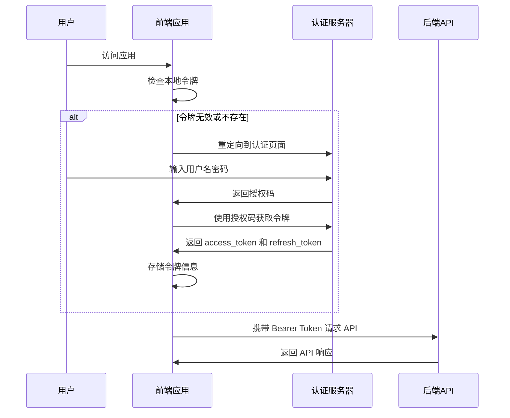

# DFApp 前后端分离迁移实施计划

## [概述 Overview]
将 `src\DFApp.Web\VueApp` 和 `src\DFApp.Web\Pages` 的所有页面迁移到 DFApp.Vue 项目，实现前后端完全分离的架构。

### 项目背景
- **现状**：基于 ABP Framework 的 Razor Pages 应用 + 嵌入式 Vue 组件
- **目标**：完全独立的 Vue 3 单页应用 + RESTful API 后端
- **技术栈**：DFApp.Vue (pure-admin-thin) + ABP OpenIddict 认证

### 核心收益
- ✅ 提升用户体验和页面加载性能
- ✅ 改善代码维护性和开发效率
- ✅ 实现真正的前后端分离架构
- ✅ 支持独立部署和横向扩展
- ✅ 为未来功能扩展提供更好的技术基础

### OpenIddict 认证服务器配置分析
基于提供的配置信息，后端已配置：
- **授权端点**：`https://localhost:44369/connect/authorize`
- **令牌端点**：`https://localhost:44369/connect/token`
- **用户信息端点**：`https://localhost:44369/connect/userinfo`
- **支持的授权模式**：authorization_code, implicit, password, client_credentials, refresh_token
- **支持的响应类型**：code, token, id_token 及其组合
- **支持的作用域**：openid, offline_access, email, profile, phone, roles, address, DFApp

## [Types]
定义迁移过程中需要的类型定义和接口规范。

### API 响应类型
```typescript
// API 基础响应类型
interface ApiResponse<T = any> {
  success: boolean;
  result: T;
  error?: {
    code: string;
    message: string;
    details?: string;
  };
}

// 分页响应类型
interface PagedResult<T> {
  items: T[];
  totalCount: number;
}

// 认证相关类型
interface LoginRequest {
  userNameOrEmailAddress: string;
  password: string;
  rememberMe?: boolean;
}

interface TokenResponse {
  access_token: string;
  token_type: string;
  expires_in: number;
  refresh_token?: string;
}

interface UserInfo {
  id: string;
  userName: string;
  email: string;
  roles: string[];
  permissions: string[];
}

// OpenIddict 相关类型
interface OidcConfig {
  authority: string;
  client_id: string;
  redirect_uri: string;
  post_logout_redirect_uri: string;
  response_type: string;
  scope: string;
  automaticSilentRenew: boolean;
  silent_redirect_uri: string;
}

interface OidcUserInfo {
  sub: string;
  name?: string;
  email?: string;
  roles?: string[];
  permissions?: string[];
}
```

### 业务实体类型
```typescript
// 彩票模块 DTO (基于现有 VueApp 组件)
interface LotteryDto {
  id: number;
  creationTime: string;
  creatorId: string;
  lastModificationTime: string;
  lastModifierId: string;
  indexNo: number;
  number: string;
  colorType: string;
  groupId: number;
}

// 支出分析 DTO (基于现有 VueApp 组件)
interface ChartJSDatasetsItemDto {
  label: string;
  data: number[];
}

interface ChartJSDto {
  labels: string[];
  datasets: ChartJSDatasetsItemDto[];
  total: number;
  compareTotal: number;
  differenceTotal: number;
}

// 其他业务实体
interface ExpenditureDto {
  id: string;
  amount: number;
  category: string;
  date: string;
  isBelongToSelf: boolean;
  creationTime: string;
  creatorId: string;
}

interface ConfigurationDto {
  name: string;
  value: string;
  displayName: string;
  description: string;
}

interface FileUploadInfoDto {
  id: string;
  fileName: string;
  filePath: string;
  fileSize: number;
  contentType: string;
  uploadTime: string;
}

interface Aria2DownloadDto {
  gid: string;
  status: string;
  totalLength: string;
  completedLength: string;
  downloadSpeed: string;
  files: Array<{
    path: string;
    length: string;
    completedLength: string;
  }>;
}
```

## [Files]
详细说明需要创建、修改和删除的文件。

### 新建文件

#### API 服务层
- `DFApp.Vue/src/api/base.ts` - API 基础服务类
- `DFApp.Vue/src/api/auth.ts` - 认证相关 API (集成 OpenIddict)
- `DFApp.Vue/src/api/lottery.ts` - 彩票模块 API
- `DFApp.Vue/src/api/bookkeeping.ts` - 记账模块 API
- `DFApp.Vue/src/api/configuration.ts` - 配置模块 API
- `DFApp.Vue/src/api/aria2.ts` - Aria2 下载管理 API
- `DFApp.Vue/src/api/fileUpload.ts` - 文件上传下载 API
- `DFApp.Vue/src/api/dynamicIp.ts` - 动态IP API
- `DFApp.Vue/src/api/logViewer.ts` - 日志查看 API
- `DFApp.Vue/src/api/telegram.ts` - Telegram 模块 API

#### 认证相关
- `DFApp.Vue/src/config/oidc.ts` - OpenIddict 配置
- `DFApp.Vue/src/utils/oidc.ts` - OpenID Connect 工具类
- `DFApp.Vue/src/views/auth/callback.vue` - 认证回调页面
- `DFApp.Vue/src/views/auth/silent-callback.vue` - 静默刷新回调页面

#### 业务页面组件
- `DFApp.Vue/src/views/dashboard/index.vue` - 仪表板首页
- `DFApp.Vue/src/views/aria2/index.vue` - Aria2 管理页面
- `DFApp.Vue/src/views/bookkeeping/` - 记账模块目录
  - `expenditure/index.vue` - 支出管理
  - `expenditure/analysis.vue` - 支出分析 (迁移现有 VueApp 组件)
  - `expenditure/chart.vue` - 支出图表
  - `category/index.vue` - 分类管理
- `DFApp.Vue/src/views/configuration/index.vue` - 配置管理
- `DFApp.Vue/src/views/dynamicIp/index.vue` - 动态IP管理
- `DFApp.Vue/src/views/fileUpload/index.vue` - 文件上传管理
- `DFApp.Vue/src/views/logViewer/index.vue` - 日志查看器
- `DFApp.Vue/src/views/lottery/` - 彩票模块目录
  - `index.vue` - 彩票数据管理
  - `statistics/index.vue` - 统计分析
  - `simulation/ssq/index.vue` - 双色球模拟
  - `simulation/kl8/index.vue` - 快乐8模拟
- `DFApp.Vue/src/views/telegram/` - Telegram 模块目录
  - `login/index.vue` - TG 登录 (迁移现有 VueApp 组件)
  - `media/index.vue` - 媒体管理
  - `media/chart.vue` - 媒体图表 (迁移现有 VueApp 组件)
  - `media/externalLink.vue` - 外部链接管理 (迁移现有 VueApp 组件)

#### 类型定义
- `DFApp.Vue/src/types/api.ts` - API 响应类型
- `DFApp.Vue/src/types/business.ts` - 业务实体类型
- `DFApp.Vue/src/types/auth.ts` - 认证相关类型

#### 路由模块
- `DFApp.Vue/src/router/modules/bookkeeping.ts` - 记账模块路由
- `DFApp.Vue/src/router/modules/lottery.ts` - 彩票模块路由
- `DFApp.Vue/src/router/modules/telegram.ts` - Telegram 模块路由
- `DFApp.Vue/src/router/modules/system.ts` - 系统管理路由
- `DFApp.Vue/src/router/modules/tools.ts` - 工具模块路由

### 迁移文件映射

#### VueApp 组件迁移
| 源文件 | 目标文件 | 迁移方式 |
|--------|----------|----------|
| `VueApp/src/Expenditure/Analysis/App.vue` | `views/bookkeeping/expenditure/analysis.vue` | 重构为 Composition API + API 调用 |
| `VueApp/src/FileUpDownload/Upload/App.vue` | `views/fileUpload/upload.vue` | 重构 + HTTP API |
| `VueApp/src/LogSink/QueueSink/App.vue` | `views/logViewer/queue.vue` | 重构 + SignalR 集成 |
| `VueApp/src/Media/Chart/App.vue` | `views/telegram/media/chart.vue` | 重构 + API 调用 |
| `VueApp/src/Media/ExternalLink/App.vue` | `views/telegram/media/externalLink.vue` | 重构 + API 调用 |
| `VueApp/src/TG/Login/App.vue` | `views/telegram/login/index.vue` | 重构 + API 调用 |

#### Razor Pages 转换
| 源页面 | 目标组件 | 转换要点 |
|--------|----------|----------|
| `Pages/Index.cshtml` | `views/dashboard/index.vue` | 移除服务器端渲染，改为客户端数据获取 |
| `Pages/Aria2/Index.cshtml` | `views/aria2/index.vue` | 表格操作改为 API 调用 |
| `Pages/Bookkeeping/Expenditure/Index.cshtml` | `views/bookkeeping/expenditure/index.vue` | CRUD 操作改为 RESTful API |
| `Pages/Configuration/Index.cshtml` | `views/configuration/index.vue` | 配置管理改为 API 调用 |
| `Pages/Lottery/Index.cshtml` | `views/lottery/index.vue` | 数据操作改为 API 调用 |

### 修改文件
- ✅ `DFApp.Vue/package.json` - 添加新依赖包
- ✅ `DFApp.Vue/.env.development` - 更新环境变量
- ✅ `DFApp.Vue/vite.config.ts` - 配置 API 代理
- `DFApp.Vue/src/router/index.ts` - 集成认证路由守卫
- `DFApp.Vue/src/store/index.ts` - 添加业务模块状态
- `DFApp.Vue/src/utils/http/index.ts` - 集成 OpenIddict 令牌管理

### 删除文件（迁移完成后）
- `src/DFApp.Web/VueApp/` - 整个目录及其子目录
- `src/DFApp.Web/Pages/` - 除认证和错误页面外的所有页面
- `src/DFApp.Web/package.json` - 清理 Vue 相关依赖
- `src/DFApp.Web/yarn.lock` - 移除前端依赖锁定文件

## [Functions]
详细说明需要创建和修改的函数。

### 新建函数

#### OpenIddict 认证函数 (`DFApp.Vue/src/utils/oidc.ts`)
```typescript
// 初始化认证管理器
function initAuthManager(): UserManager

// 启动认证流程
async function startAuthentication(): Promise<void>

// 处理认证回调
async function handleAuthCallback(): Promise<User | null>

// 获取当前用户信息
async function getCurrentUser(): Promise<User | null>

// 静默刷新令牌
async function silentRenew(): Promise<User | null>

// 登出
async function logout(): Promise<void>

// 检查认证状态
function isAuthenticated(): boolean
```

#### API 基础服务函数 (`DFApp.Vue/src/api/base.ts`)
```typescript
// API 基础服务类
class ApiService {
  protected baseURL: string;
  protected http: AxiosInstance;
  
  constructor(baseURL: string);
  
  // 通用请求方法
  protected async request<T>(config: AxiosRequestConfig): Promise<T>;
  protected async get<T>(url: string, params?: any): Promise<T>;
  protected async post<T>(url: string, data?: any): Promise<T>;
  protected async put<T>(url: string, data?: any): Promise<T>;
  protected async delete<T>(url: string): Promise<T>;
}
```

#### 业务模块 API 函数
```typescript
// 彩票模块 API (src/api/lottery.ts)
class LotteryApi extends ApiService {
  async getLotteries(params: GetLotteriesInput): Promise<PagedResult<LotteryDto>>;
  async getLottery(id: number): Promise<LotteryDto>;
  async createLottery(input: CreateLotteryDto): Promise<LotteryDto>;
  async updateLottery(id: number, input: UpdateLotteryDto): Promise<LotteryDto>;
  async deleteLottery(id: number): Promise<void>;
  async getStatistics(params: StatisticsInput): Promise<StatisticsDto>;
}

// 记账模块 API (src/api/bookkeeping.ts)
class BookkeepingApi extends ApiService {
  async getExpenditures(params: GetExpendituresInput): Promise<PagedResult<ExpenditureDto>>;
  async getChartData(input: ChartDataInput): Promise<ChartJSDto>;
  async createExpenditure(input: CreateExpenditureDto): Promise<ExpenditureDto>;
  async updateExpenditure(id: string, input: UpdateExpenditureDto): Promise<ExpenditureDto>;
  async deleteExpenditure(id: string): Promise<void>;
  async getCategories(): Promise<CategoryDto[]>;
}

// 文件管理 API (src/api/fileUpload.ts)
class FileUploadApi extends ApiService {
  async uploadFile(file: File, onProgress?: (progress: number) => void): Promise<FileUploadInfoDto>;
  async getFileList(params: GetFileListInput): Promise<PagedResult<FileUploadInfoDto>>;
  async deleteFile(id: string): Promise<void>;
  async downloadFile(id: string): Promise<Blob>;
}

// Aria2 管理 API (src/api/aria2.ts)
class Aria2Api extends ApiService {
  async getDownloads(): Promise<Aria2DownloadDto[]>;
  async addDownload(input: AddDownloadInput): Promise<string>;
  async pauseDownload(gid: string): Promise<void>;
  async resumeDownload(gid: string): Promise<void>;
  async removeDownload(gid: string): Promise<void>;
}

// 配置管理 API (src/api/configuration.ts)
class ConfigurationApi extends ApiService {
  async getConfigurations(): Promise<ConfigurationDto[]>;
  async getConfiguration(name: string): Promise<ConfigurationDto>;
  async updateConfiguration(name: string, value: string): Promise<void>;
  async createConfiguration(input: CreateConfigurationDto): Promise<ConfigurationDto>;
  async deleteConfiguration(name: string): Promise<void>;
}

// Telegram API (src/api/telegram.ts)
class TelegramApi extends ApiService {
  async login(phoneNumber: string): Promise<TelegramLoginDto>;
  async verifyCode(code: string): Promise<boolean>;
  async getMediaList(params: GetMediaListInput): Promise<PagedResult<MediaDto>>;
  async getMediaChart(params: ChartParams): Promise<MediaChartDto>;
  async getExternalLinks(params: GetLinksInput): Promise<PagedResult<ExternalLinkDto>>;
  async createExternalLink(input: CreateLinkDto): Promise<ExternalLinkDto>;
  async deleteExternalLink(id: string): Promise<void>;
}

// 日志查看 API (src/api/logViewer.ts)
class LogViewerApi extends ApiService {
  async getLogs(params: GetLogsInput): Promise<PagedResult<LogEntryDto>>;
  async getLogLevels(): Promise<string[]>;
  async clearLogs(before?: Date): Promise<void>;
  // SignalR 连接管理
  async connectLogHub(): Promise<HubConnection>;
  async subscribeToLogs(callback: (log: LogEntryDto) => void): Promise<void>;
}

// 动态IP API (src/api/dynamicIp.ts)
class DynamicIpApi extends ApiService {
  async getCurrentIp(): Promise<DynamicIpDto>;
  async getIpHistory(params: GetIpHistoryInput): Promise<PagedResult<DynamicIpDto>>;
  async updateIpProvider(provider: string): Promise<void>;
  async forceRefreshIp(): Promise<DynamicIpDto>;
}
```

### 修改函数

#### 路由守卫函数 (`DFApp.Vue/src/router/index.ts`)
```typescript
// 修改现有的路由守卫，添加权限检查
router.beforeEach(async (to, from, next) => {
  // 添加认证检查
  // 添加权限验证
  // 处理令牌刷新
})
```

#### 状态管理函数 (`DFApp.Vue/src/store/modules/auth.ts`)
```typescript
// 登录 action
async function login(credentials: LoginRequest): Promise<void>

// 登出 action
async function logout(): Promise<void>

// 获取用户信息 action
async function getUserInfo(): Promise<void>
```

## [Classes]
详细说明需要创建和修改的类。

### 新建类

#### HTTP 客户端类 (`DFApp.Vue/src/utils/http.ts`)
```typescript
class HttpClient {
  private instance: AxiosInstance;
  
  constructor(baseURL: string) {
    // 初始化 axios 实例
    // 设置请求拦截器
    // 设置响应拦截器
  }
  
  async request<T>(config: AxiosRequestConfig): Promise<ApiResponse<T>>
  async get<T>(url: string, params?: any): Promise<ApiResponse<T>>
  async post<T>(url: string, data?: any): Promise<ApiResponse<T>>
  async put<T>(url: string, data?: any): Promise<ApiResponse<T>>
  async delete<T>(url: string): Promise<ApiResponse<T>>
}
```

#### 认证管理类 (`DFApp.Vue/src/utils/auth.ts`)
```typescript
class AuthManager {
  private tokenKey: string = 'access_token';
  private refreshTokenKey: string = 'refresh_token';
  
  getToken(): string | null
  setToken(token: string): void
  clearToken(): void
  isAuthenticated(): boolean
  async refreshToken(): Promise<boolean>
}
```

#### API 服务基类 (`DFApp.Vue/src/api/base.ts`)
```typescript
abstract class BaseApiService {
  protected http: HttpClient;
  protected baseUrl: string;
  
  constructor(baseUrl: string) {
    this.baseUrl = baseUrl;
    this.http = new HttpClient(baseUrl);
  }
  
  protected buildUrl(endpoint: string): string
}
```

### 修改类

#### 现有组件类重构
将现有的 VueApp 组件从 Options API 重构为 Composition API：
```typescript
// 示例：支出分析组件
export default defineComponent({
  name: 'ExpenditureAnalysis',
  setup() {
    // 使用 Composition API 重构
    // 添加响应式数据
    // 添加计算属性
    // 添加方法
    // 添加生命周期钩子
  }
})
```

## [OpenIddict 集成方案]
基于后端已配置的 OpenIddict 服务器，设计前端认证集成方案。

### 认证流程设计


### 认证配置
```typescript
// src/config/oidc.ts
export const oidcConfig: OidcConfig = {
  authority: 'https://localhost:44369',
  client_id: 'DFApp_Vue',
  redirect_uri: `${window.location.origin}/auth/callback`,
  post_logout_redirect_uri: `${window.location.origin}/`,
  response_type: 'code',
  scope: 'openid profile email roles permissions DFApp offline_access',
  automaticSilentRenew: true,
  silent_redirect_uri: `${window.location.origin}/auth/silent-callback`,
  // 使用 PKCE 增强安全性
  client_authentication: 'pkce'
};
```

### 认证服务类更新
```typescript
// src/utils/auth.ts 增强版本
export class AuthService {
  private userManager: UserManager;
  
  constructor() {
    this.userManager = new UserManager(oidcConfig);
  }
  
  // OAuth 2.0 Authorization Code Flow
  async login(): Promise<void> {
    await this.userManager.signinRedirect();
  }
  
  // 处理认证回调
  async handleCallback(): Promise<User | null> {
    return await this.userManager.signinRedirectCallback();
  }
  
  // 获取当前用户
  async getCurrentUser(): Promise<User | null> {
    return await this.userManager.getUser();
  }
  
  // 静默刷新令牌
  async renewToken(): Promise<User | null> {
    return await this.userManager.signinSilent();
  }
  
  // 登出
  async logout(): Promise<void> {
    await this.userManager.signoutRedirect();
  }
}
```

## [Dependencies]
基于现有 DFApp.Vue 项目和新需求，更新依赖配置。

### 现有依赖分析
DFApp.Vue 项目已包含的核心依赖：
- ✅ `axios: ^1.11.0` - HTTP 客户端
- ✅ `element-plus: ^2.10.4` - UI 组件库
- ✅ `echarts: ^5.6.0` - 图表库
- ✅ `pinia: ^3.0.3` - 状态管理
- ✅ `vue-router: ^4.5.1` - 路由管理

### 新增依赖包
```json
{
  "dependencies": {
    "oidc-client-ts": "^3.0.1",
    "@microsoft/signalr": "^8.0.0",
    "crypto-js": "^4.2.0",
    "chart.js": "^4.4.0"
  },
  "devDependencies": {
    "@types/crypto-js": "^4.2.0"
  }
}
```

### 依赖说明
- `oidc-client-ts` - OpenID Connect 客户端，集成 ABP OpenIddict 认证
- `@microsoft/signalr` - SignalR 客户端，用于实时日志查看等功能
- `crypto-js` - 加密工具库，用于敏感数据处理
- `chart.js` - 已存在 echarts，保留 chart.js 用于特定图表需求

### 环境配置更新
更新 `.env.development`：
```bash
# 平台本地运行端口号
VITE_PORT = 8848

# 开发环境读取配置文件路径
VITE_PUBLIC_PATH = /

# 开发环境路由历史模式
VITE_ROUTER_HISTORY = "hash"

# 后端 API 基础地址
VITE_API_BASE_URL = "https://localhost:44350"

# OpenIddict 认证服务器地址
VITE_AUTH_AUTHORITY = "https://localhost:44369"

# OAuth 客户端 ID
VITE_OAUTH_CLIENT_ID = "DFApp_Vue"
```

更新 `vite.config.ts` 代理配置：
```typescript
export default ({ mode }: ConfigEnv): UserConfigExport => {
  const { VITE_PORT, VITE_API_BASE_URL } = wrapperEnv(loadEnv(mode, root));
  
  return {
    server: {
      port: VITE_PORT,
      proxy: {
        '/api': {
          target: VITE_API_BASE_URL,
          changeOrigin: true,
          secure: false,
          rewrite: (path) => path.replace(/^\/api/, '/api')
        },
        '/connect': {
          target: 'https://localhost:44369',
          changeOrigin: true,
          secure: false
        }
      }
    }
  };
};
```

## [Testing]
详细说明测试策略和测试文件要求。

### 测试文件结构
```
DFApp.Vue/tests/
├── unit/
│   ├── components/
│   ├── utils/
│   └── api/
├── integration/
│   ├── auth/
│   └── api/
└── e2e/
    ├── login.spec.ts
    ├── lottery.spec.ts
    └── bookkeeping.spec.ts
```

### 单元测试
- 为所有 API 服务类编写单元测试
- 为认证工具类编写测试
- 为关键组件编写组件测试

### 集成测试
- 测试认证流程集成
- 测试 API 调用集成
- 测试路由权限集成

### E2E 测试
- 用户登录流程测试
- 主要功能模块的端到端测试
- 权限控制测试

### 测试配置
更新测试配置文件，添加必要的测试工具和模拟数据。

## [Implementation Order]
基于现有项目分析，制定详细的分阶段实施策略。

### 📋 总体时间规划：8-10周
- **第一阶段**：基础设施搭建（2周）
- **第二阶段**：认证与API层（2-3周）
- **第三阶段**：组件迁移（3-4周）
- **第四阶段**：集成测试与优化（1周）
- **第五阶段**：部署上线（1周）

### 🔧 第一阶段：基础设施搭建（第1-2周）

#### 1.1 项目配置更新
- [ ] **依赖包管理**
  - 添加 `oidc-client-ts`, `@microsoft/signalr`, `crypto-js` 等新依赖
  - 更新现有依赖到最新稳定版本
  - 配置 TypeScript 类型支持

- [ ] **环境配置**
  - 更新 `.env.development` 和 `.env.production`
  - 配置 API 基础地址和认证服务器地址
  - 设置 OAuth 客户端配置参数

- [ ] **构建配置**
  - 更新 `vite.config.ts` 代理设置
  - 配置开发环境和生产环境构建选项
  - 优化打包体积和加载性能

#### 1.2 认证基础架构
- [ ] **OpenIddict 集成**
  - 创建 `src/config/oidc.ts` 配置文件
  - 实现 `src/utils/oidc.ts` 认证工具类
  - 集成 oidc-client-ts 库

- [ ] **认证页面**
  - 创建认证回调页面 `/auth/callback`
  - 创建静默刷新页面 `/auth/silent-callback`
  - 更新登录页面集成 OAuth 流程

#### 1.3 HTTP 客户端增强
- [ ] **现有 HTTP 工具类优化**
  - 集成 OpenIddict 令牌管理到现有 `src/utils/http/index.ts`
  - 添加自动令牌刷新机制
  - 实现请求重试和错误处理

### 🔌 第二阶段：认证与API层（第3-5周）

#### 2.1 API 服务层架构
- [ ] **API 基础类**
  - 创建 `src/api/base.ts` 基础服务类
  - 实现通用的 CRUD 操作方法
  - 添加统一的错误处理和响应格式化

- [ ] **业务模块 API**
  - `src/api/bookkeeping.ts` - 记账模块 API
  - `src/api/lottery.ts` - 彩票模块 API
  - `src/api/aria2.ts` - Aria2 下载管理 API
  - `src/api/fileUpload.ts` - 文件上传管理 API
  - `src/api/configuration.ts` - 配置管理 API
  - `src/api/telegram.ts` - Telegram 模块 API

#### 2.2 类型定义系统
- [ ] **类型文件创建**
  - `src/types/api.ts` - API 响应和请求类型
  - `src/types/business.ts` - 业务实体类型
  - `src/types/auth.ts` - 认证相关类型

#### 2.3 路由与权限系统
- [ ] **路由模块重构**
  - 基于现有路由结构，添加业务模块路由
  - 集成认证守卫到路由系统
  - 实现基于角色的页面权限控制

- [ ] **状态管理扩展**
  - 基于现有 Pinia store，添加业务模块状态
  - 实现统一的错误状态管理
  - 添加加载状态和用户反馈机制

### 🔄 第三阶段：组件迁移（第6-9周）

#### 3.1 高优先级组件迁移（第6周）
- [ ] **支出分析组件**
  - 迁移 `VueApp/src/Expenditure/Analysis/App.vue`
  - 重构为 Composition API
  - 替换 ABP 服务调用为 HTTP API 调用
  - 集成到 `views/bookkeeping/expenditure/analysis.vue`

- [ ] **文件上传组件**
  - 迁移 `VueApp/src/FileUpDownload/Upload/App.vue`
  - 实现新的文件上传 API 集成
  - 添加上传进度和错误处理

#### 3.2 Telegram 模块迁移（第7周）
- [ ] **TG 登录组件**
  - 迁移 `VueApp/src/TG/Login/App.vue`
  - 更新为 API 调用方式

- [ ] **媒体管理组件**
  - 迁移 `VueApp/src/Media/Chart/App.vue`
  - 迁移 `VueApp/src/Media/ExternalLink/App.vue`
  - 重构图表组件使用 ECharts

#### 3.3 主要页面转换（第8-9周）
- [ ] **首页重构**
  - 转换 `Pages/Index.cshtml` → `views/dashboard/index.vue`
  - 实现仪表板数据获取
  - 添加统计图表和概览信息

- [ ] **记账模块页面**
  - 转换支出管理页面
  - 转换分类管理页面
  - 集成已迁移的分析组件

- [ ] **彩票模块页面**
  - 转换彩票数据管理页面
  - 转换统计分析页面
  - 转换模拟功能页面

- [ ] **系统管理页面**
  - 转换配置管理页面
  - 转换 Aria2 管理页面
  - 转换日志查看器页面

### 🧪 第四阶段：集成测试与优化（第10周）

#### 4.1 功能测试
- [ ] **端到端测试**
  - 用户认证流程测试
  - 主要业务功能测试
  - 权限控制测试

- [ ] **性能优化**
  - 组件懒加载配置
  - 打包体积优化
  - 首屏加载优化

#### 4.2 用户体验改进
- [ ] **界面优化**
  - 响应式设计调整
  - 加载状态优化
  - 错误提示完善

### 🚀 第五阶段：部署上线（第11周）

#### 5.1 生产环境准备
- [ ] **构建配置**
  - 生产环境变量配置
  - 构建脚本优化
  - CDN 资源配置

- [ ] **部署配置**
  - Nginx 配置文件
  - 容器化配置 (Docker)
  - CI/CD 管道配置

#### 5.2 清理工作
- [ ] **代码清理**
  - 删除 `src/DFApp.Web/VueApp/` 目录
  - 清理不需要的 Razor Pages
  - 更新项目文档

- [ ] **监控配置**
  - 错误监控配置
  - 性能监控配置
  - 用户行为分析配置

### ⚠️ 风险控制与回滚策略

#### 风险评估
1. **认证集成风险** - OpenIddict 配置复杂性
2. **数据迁移风险** - API 调用方式变更
3. **性能风险** - 单页应用首屏加载时间
4. **兼容性风险** - 浏览器兼容性问题

#### 回滚策略
- 保留原有 Razor Pages 应用，直到新应用稳定运行
- 使用功能开关控制新旧系统切换
- 准备数据回滚脚本和配置回滚方案
- 建立快速故障恢复流程

### 📊 成功指标

#### 技术指标
- [ ] 首屏加载时间 < 3秒
- [ ] API 响应时间 < 500ms
- [ ] 单元测试覆盖率 > 80%
- [ ] 零认证相关安全问题

#### 业务指标
- [ ] 用户操作流程简化 30%
- [ ] 页面加载速度提升 50%
- [ ] 开发效率提升 40%
- [ ] 部署频率提升 200%


---

## [总结 Summary]

### 📝 计划完整性评估
本实施计划基于对现有 DFApp.Vue 项目和 DFApp.Web 项目的深入分析，结合您提供的 OpenIddict 配置信息，制定了详细的前后端分离迁移方案。计划涵盖了：

✅ **技术架构设计** - 完整的认证、API、组件架构
✅ **迁移策略** - 分阶段、低风险的迁移路径
✅ **详细实施步骤** - 具体的时间规划和任务分解
✅ **风险控制** - 完善的回滚和应急方案

### 🎯 核心亮点

#### 1. **充分利用现有基础**
- 基于 pure-admin-thin 的成熟 Vue 3 架构
- 复用现有的 HTTP 客户端和状态管理
- 保留现有的 UI 组件库和工具链

#### 2. **安全的认证集成**
- 完整的 OpenIddict OAuth 2.0 集成
- 支持 PKCE 增强安全性
- 自动令牌刷新机制

#### 3. **渐进式迁移**
- 优先迁移高价值组件
- 保持系统持续可用
- 降低业务风险

#### 4. **可扩展的架构**
- 模块化的 API 服务层
- 统一的类型定义系统
- 标准化的错误处理

### ⚡ 即时可执行的任务

基于分析，以下任务可以立即开始：

#### 第一优先级（本周可开始）
1. **依赖包更新**
   ```bash
   cd DFApp.Vue
   pnpm add oidc-client-ts @microsoft/signalr crypto-js
   pnpm add -D @types/crypto-js
   ```

2. **环境配置更新**
   - 更新 `.env.development` 添加后端 API 地址
   - 配置 OpenIddict 认证服务器地址
   - 更新 Vite 代理配置

3. **OpenIddict 配置文件创建**
   - 创建 `src/config/oidc.ts`
   - 基于提供的服务器配置设置客户端参数

#### 第二优先级（下周开始）
1. **API 基础服务层**
   - 创建 `src/api/base.ts` 基础服务类
   - 集成现有 HTTP 客户端
   - 添加认证令牌管理

2. **认证回调页面**
   - 创建认证回调处理页面
   - 集成到现有路由系统

### 🔄 持续优化建议

#### 开发过程中
- 采用 TypeScript 严格模式，确保类型安全
- 实施代码审查流程，保证代码质量
- 建立自动化测试覆盖关键业务逻辑
- 监控性能指标，及时优化瓶颈

#### 上线后
- 收集用户反馈，持续优化用户体验
- 监控系统性能，优化加载速度
- 分析用户行为，改进功能设计
- 建立运维监控，确保系统稳定性

### 🤝 下一步行动

我建议您：

1. **审查计划** - 确认实施策略和时间安排是否符合业务需求
2. **资源确认** - 确保开发团队有足够的时间和技能资源
3. **环境准备** - 确保开发、测试、生产环境都已就绪
4. **开始执行** - 从第一阶段的基础设施搭建开始

如果您对计划的任何部分有疑问或需要调整，我可以进一步细化或修改相应的部分。

### 📞 技术支持

在实施过程中，如果遇到以下情况，建议及时寻求支持：
- OpenIddict 认证集成遇到技术难题
- 现有组件迁移遇到兼容性问题
- 性能优化需要专业建议
- 部署配置需要运维支持

---

**此计划文档将作为项目实施的指导蓝图，建议定期更新和调整以反映实际进展和变更需求。**
